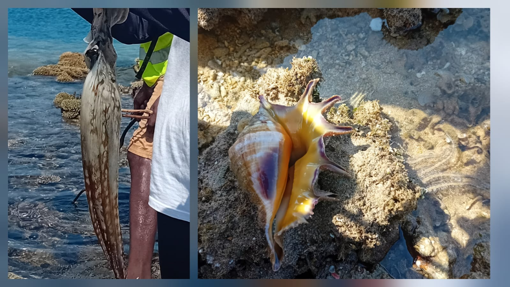
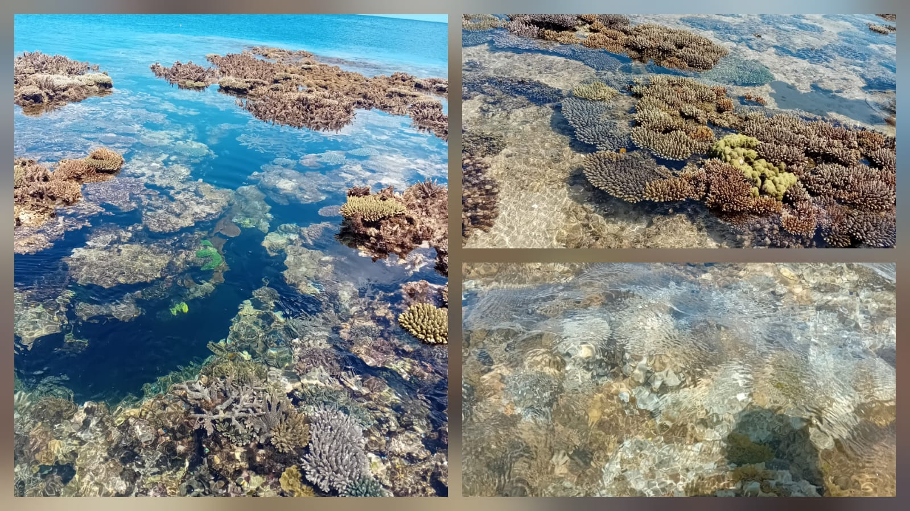

  # Contexte

Le lagon de Mayotte est confronté à des problèmes anthropique depuis le $XXI^{ème} siècle$. 
Ces contraintes conduisent à la dégradation des écosystèmes locaux, menaçant ainsi les ressources exploitées.
Dans cet écosystème, une éspèce est particulièrement importante, à savoir le poulpe. Elle constitue une espèce clé pour l’écosystème et pour la pêche artisanale locale, 
dont la dynamique dépend de facteurs environnementaux mais aussi des activités humaines.

Les modèles d'aujourd'hui pemettent d'étudier ces fluctuation, mais ne prennent ou peu en compte les pressions anthropique. 
Ainsi, développer des approches intégrant ces effets semble nécessaire.


# L'objectif du projet

L'objectif premier de ce projet consiste à mettre en place des modèles statistiques tenant compte de la dynamique réelle des populations et des activités humaines, en plus des covariables environnementales.
Par exemple, un modèle de mélange dynamique spatio-temporel intégrant :

  - L'évolution de l'abondance réelle de poulpes dans le temps et l'espace;
  - Des covariables environnementales;
  - Des covariables sociales et économiques;
  - Des relations non-linéaires entre ces covariables.

Enfin, les outils méthodologique qui seront développés et les résultats obtenus seront exploités pour la gestion durable des ressources aquatiques à Mayotte.

## L'arborescence provisoir

```
.
├── LICENSE
├── README.md
├── data/
├── scripts/
│ ├── Rmd/
│ └── data_simule.R
├── notes/
│ ├── Objectifs/
│ └── plan/
├── archive/
├── autres_fichiers/
├── vis/
│ ├── schema_MH.png
│ ├── Sortie_Ter/
│ └── logo/
.
```

### Description des dossiers

- LICENSE : licence du projet.  
- README.md : description du projet et instructions pour reproduire les analyses.  
- data/ : données utilisées pour le projet. Les données confidentielles ne sont pas versionnées.  
- scripts/ : fichiers R et R Markdown pour réaliser les analyses et générer les documents.  
  - Rmd/ : fichiers R Markdown.  
  - data_simule.R : script pour générer des données simulées.  
- notes/ : documents PDF générés à partir des fichiers R Markdown.  
  - Objectifs/ : documents liés aux objectifs du projet.  
  - plan/ : documents relatifs au plan de travail.  
- archive/ : anciens documents, fichiers et figures.  
- autres_fichiers/ : fichiers complémentaires ou ressources diverses.  
- vis/ : éléments visuels utilisés dans le projet.  
  - Sortie_Ter/ : images et figures liées aux sorties terrain.  
  - logo/ : logos utilisés dans les documents.  
  - schema_MH.png : schéma général du projet.
  
## Sortie terrain – 19 et 20 mars 2026

Le 19 mars, nous avons réalisé une sortie terrain à Sohoa pour observer les pratiques de pêche et enquêter sur la connaissance de la réglementation par les pêcheurs.  




Le 20 mars, la sortie prévue n’a pas pu avoir lieu à cause d’un accident sur la route de Tsingoni. Les gendarmes sur place nous ont demandé de faire demi-tour.
